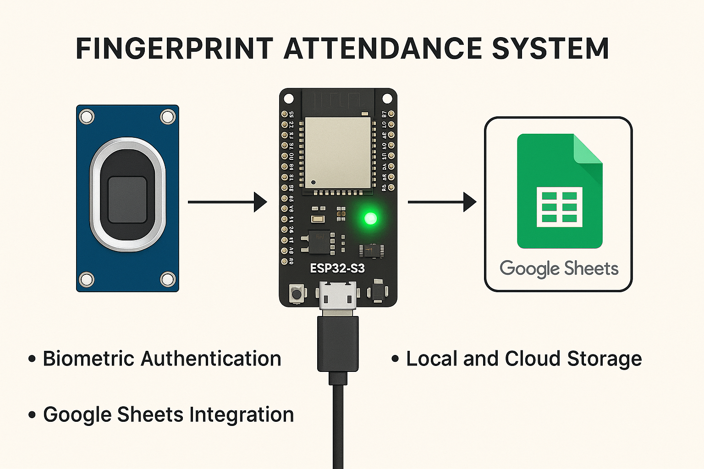

# Fingerprint Attendance System

A comprehensive biometric attendance tracking solution using ESP32-S3, a fingerprint sensor, and Google Sheets integration.



## Overview

This project implements a portable biometric attendance system that allows tracking attendance using fingerprint recognition. The system stores attendance data locally and syncs it with Google Sheets when connected to WiFi, making it ideal for classrooms, small offices, or any environment requiring reliable attendance tracking without constant internet connectivity.

## Features

- ✅ **Biometric Authentication**: Secure fingerprint scanning and recognition
- ✅ **Local Storage**: Saves attendance records when offline using SPIFFS
- ✅ **Cloud Sync**: Synchronizes data with Google Sheets when connected to WiFi
- ✅ **BLE Support**: Control and monitor the device via Bluetooth Low Energy
- ✅ **Visual Feedback**: RGB LED indicator for operation status
- ✅ **Date Management**: Set custom dates for attendance tracking
- ✅ **Data Management**: View, sync, and clear attendance records
- ✅ **Statistical Analysis**: Automatic calculation of attendance percentages in Google Sheets

## Hardware Requirements

- ESP32-S3 development board
- Adafruit or compatible optical fingerprint sensor
- NeoPixel RGB LED
- Power supply (USB or battery)
- Enclosure (optional)

## Software Dependencies

### ESP32 Libraries

- Arduino core for ESP32
- Adafruit Fingerprint Library
- Adafruit NeoPixel Library
- WiFiClientSecure
- BLE libraries for ESP32
- SPIFFS for file storage

### Google Apps Script

- Google Sheets API
- Apps Script for handling HTTP requests

## Setup Instructions

### Hardware Setup

1. Connect the fingerprint sensor to the ESP32-S3:

   - RX pin to GPIO17
   - TX pin to GPIO16
   - VCC to 3.3V
   - GND to GND

2. Connect the NeoPixel LED to GPIO48, VCC, and GND

3. Power the ESP32-S3 via USB or external power source

### Software Setup

#### ESP32 Configuration

1. Install the Arduino IDE and required libraries
2. Configure your WiFi credentials in the code:

   ```cpp
   const char *ssid = "YourWiFiSSID";
   const char *password = "YourWiFiPassword";
   ```

3. Set up your Google Script deployment ID:

   ```cpp
   const char *GScriptId = "YourGoogleScriptDeploymentID";
   ```

4. Upload the code to your ESP32-S3

#### Google Apps Script Setup

1. Create a new Google Sheet
2. Go to Extensions > Apps Script
3. Copy and paste the provided Google Apps Script code
4. Deploy as a web app:
   - Execute the app as: "Me"
   - Who has access: "Anyone"
5. Copy the deployment ID and update it in the ESP32 code

## Usage

### Main Menu Options

1. **Enroll Mode**: Register new fingerprints with unique IDs
2. **Attendance Mode**: Record attendance by scanning fingerprints
3. **Clear All Fingerprints**: Delete all stored fingerprint templates
4. **View Stored Records**: Display locally stored attendance records
5. **Sync to Google Sheets**: Upload attendance data to Google Sheets
6. **Clear Attendance Data**: Erase all attendance records
7. **Set Current Date**: Change the date for attendance recording
8. **Update WiFi Settings**: Add or Update Wi-Fi SSID and password
9. **Show Menu (Help)**: Re-display the main menu

### BLE Control

The system can be controlled via Bluetooth using any BLE serial terminal app. Commands are the same as those available through the serial monitor.

## Google Sheets Integration

The system sends attendance data to a Google Sheet with the following format:

- **Column A**: Student ID (fingerprint ID)
- **Date Columns**: Attendance status for each date
- **Statistics Columns**:
  - Attended Days: Count of days present
  - Percentage: Attendance percentage

## Troubleshooting

- **Fingerprint Sensor Not Detected**: Check wiring connections and try lowering the baud rate
- **WiFi Connection Issues**: Verify credentials and ensure the ESP32 is within range of the WiFi network
- **Sync Failures**: Check your Google Script deployment ID and ensure it's properly deployed as a web app
- **File System Errors**: Try reformatting the SPIFFS partition

## Project Structure

- **Main ESP32 Code**: Handles the core functionality including fingerprint operations, BLE, and WiFi
- **Google Apps Script**: Processes incoming data and manages the spreadsheet
- **SPIFFS Storage**: Manages local CSV storage for offline operation

## License

This project is released under the MIT License.

## Acknowledgments

- Adafruit for their excellent fingerprint and NeoPixel libraries
- ESP32 community for BLE and WiFi implementation examples
- Google for Apps Script and Sheets API

## Contributing

Contributions are welcome! Please feel free to submit a Pull Request.

## Future Improvements

- Web dashboard for attendance visualization
- Enhanced security features
- Multiple fingerprint support per user
- Custom user names instead of numeric IDs
- Email notifications for attendance reports
